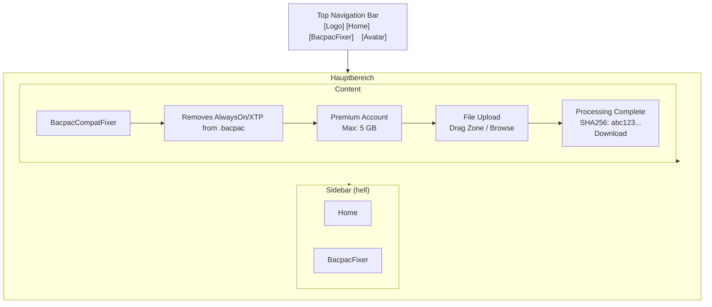
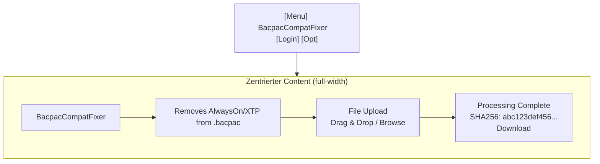

# BacpacCompatFixer – Layout-Analyse und Verbesserungsvorschläge

> **Erstellt:** 2026-04-26 · **Basis:** Screenshot + Code-Analyse der Blazor-Anwendung

---

## 1. Aktuelles Layout

### 1.1 Gesamtaufbau

Die Anwendung verwendet ein **klassisches Sidebar-Layout** nach dem Blazor-Server-Template-Muster:

```
┌─────────────────┬───────────────────────┐
│   Sidebar       │   Top-Row             │
│    (links)      │  [About-Link]         │
│                 ├───────────────────────┤
│   BacpacCompat  │  LoginDisplay         │
│      Fixer      │                       │
│                 │   Hauptinhalt         │
│       Home      │  ┌─────────────────┐  │
│      Tools      │  │  BacpacCompat   │  │
│                 │  │  File Upload    │  │
│                 │  │  Process Button │  │
│                 │  │  Results        │  │
│                 │  └─────────────────┘  │
└─────────────────┴───────────────────────┘
```

### 1.2 Farbpalette

| Element | Farbe |
| --- | --- |
| Sidebar-Hintergrund | Linearer Gradient: `rgb(5, 39, 103)` (Dunkelblau) → `#3a0647` (Dunkellila) |
| Top-Row | `#f7f7f7` (Hellgrau) |
| Aktiver Nav-Link | `rgba(255, 255, 255, 0.37)` (Weiss) |
| Inaktiver Nav-Link | `#d7d7d7` (Hellgrau) |
| Primary Button | `#1b6ec2` (Blau) |
| Content-Hintergrund | `#ffffff` (Weiss) |

### 1.3 Layout-Details

**Sidebar (Navigation)**

- Breite: 250 px (fest, sticky)
- Höhe: 100 vh (vollständig, scrollbar)
- Hintergrund: Blau-Lila-Gradient
- Inhalt: Brand-Name + 2 Nav-Links mit Bootstrap-Icons
- Mobile: Hamburger-Menü (navbar-toggler)

**Top-Row (Header rechts)**

- Höhe: 3.5 rem (sticky positioned)
- Hintergrund: `#f7f7f7` (hellgrau) mit Border
- Inhalt: "About"-Link nach Microsoft Learn

**Hauptinhalt**

- Breite: Verbleibende Breite nach Sidebar (flex: 1)
- Padding: 2 rem links/rechts (ab 641 px)
- Elemente: Titel → Subtext → Status-Banner → Upload-Card → Process-Button → Ergebnis

### 1.4 Typografie

| Element | Wert |
| --- | --- |
| Schriftfamilie | Helvetica Neue, Helvetica, Arial, sans-serif |
| Nav-Item | 0.9 rem |
| Navbar-Brand | 1.1 rem |
| Link-Farbe | `#006bb7` (Blau) |

### 1.5 Responsivität

| Bildschirmbreite | Verhalten |
| --- | --- |
| < 640 px | Sidebar kollabiert, Hamburger-Menü, Top-Row angepasst |
| ≥ 641 px | Sidebar fix (250 px), vollständiges Layout |

---

## 2. Verbesserungsvorschläge

### 2.1 Layout-Struktur – Vorschlag A: Card-basiertes Layout

Top-Navigation (hell) + helle Sidebar + Cards im Content:



**Vorteile:**

- Moderner, professioneller Look
- Mehr Content-Platz durch schlankere Sidebar
- Klare visuelle Hierarchie durch Card-Gruppierung
- Microsoft Fluent Design konform

### 2.2 Layout-Struktur – Vorschlag B: Zentrales Full-Width Layout

Navigation in der Top-Bar, Content zentriert und full-width:



**Vorteile:**

- Maximale Content-Breite
- Minimalistische, aufgeräumte Oberfläche
- Weniger kognitive Last (keine Sidebar)

### 2.3 Spezifische Design-Verbesserungen

#### File Upload

| Aktuell | Verbesserung | Begründung |
| --- | --- | --- |
| Kleines Input-Field | Grosser Drag & Drop Zone | Bessere UX, klarere Interaktion |

#### Status-Anzeige

| Aktuell | Verbesserung | Begründung |
| --- | --- | --- |
| Inline Alerts | Badge-basierte Status-Anzeige | Schneller erfassbar |

#### Farbgebung

| Aktuell | Verbesserung | Begründung |
| --- | --- | --- |
| Dunkler Blau-Lila-Gradient | Helles Fluent-Design-Theme | Moderner, weniger Augenbelastung |
| Einfache Farben | Microsoft-Palette (`#0078d4`) | Konsistenz mit MS-Produkten |
| Flache Buttons | Buttons mit Rändern & Schatten | Bessere visuelle Hierarchie |

#### Typografie

| Aktuell | Verbesserung | Begründung |
| --- | --- | --- |
| Helvetica Neue (System) | System-Font-Stack (Segoe UI) | Konsistent über alle Plattformen |

### 2.4 Empfohlene Änderungen (priorisiert)

| Priorität | Änderung | Aufwand | Impact |
| --- | --- | --- | --- |
| **Hoch** | Drag & Drop File Upload Zone | Mittel | Hoch |
| **Hoch** | Top-Navigation statt Sidebar | Hoch | Hoch |
| **Mittel** | Helles Theme statt dunklem Gradient | Mittel | Mittel |
| **Mittel** | System-Font-Stack einbinden | Gering | Gering |
| **Gering** | Animationen für Loading States | Mittel | Gering |
| **Gering** | Dark Mode Support | Hoch | Mittel |

### 2.5 Empfohlene neue Farbpalette (Helles Fluent Theme)

**Primary**

| Variable | Farbe | Zweck |
| --- | --- | --- |
| `#0078d4` | Hauptfarbe | Buttons, Links |
| `#106ebe` | Hover | Hover-States |
| `#eff6fc` | Light BG | Helle Hintergründe |

**Neutral**

| Variable | Farbe | Zweck |
| --- | --- | --- |
| `#ffffff` | Primary BG | Seitenhintergrund |
| `#f3f2f1` | Secondary BG | Cards, Inputs |
| `#faf9f8` | Sidebar BG | Leichte Sidebar |
| `#323130` | Primary Text | Hauptschrift |
| `#605e5c` | Secondary Text | Untertitel |
| `#8a8886` | Muted Text | Platzhalter |

**Status**

| Variable | Farbe | Zweck |
| --- | --- | --- |
| `#107c10` | Success (Grün) | Erfolgs-Meldungen |
| `#ffaa44` | Warning (Orange) | Warnungen |
| `#d13438` | Error (Rot) | Fehler |
| `#0078d4` | Info (Blau) | Informationen |

**Borders**

| Variable | Farbe | Zweck |
| --- | --- | --- |
| `#e1dfdd` | Standard | Normale Borders |
| `#0078d4` | Focus | Fokus-Borders |

---

## 3. Zusammenfassung

### Bestehendes Layout

Das aktuelle Layout basiert auf dem **Blazor Server-Template**:

- Dunkle Gradient-Sidebar (links, 250 px)
- Hellgrauer Top-Row-Header (sticky)
- Bootstrap-Cards als Content-Container
- Einfacher File-Input

### Hauptverbesserungspotenziale

1. **Drag & Drop File Upload** – bessere User Experience
2. **Helles Theme** – modernerer Look
3. **Top-Navigation** – mehr Content-Platz
4. **Microsoft Design Language** – Konsistenz mit Microsoft-Produkten

---

*Erstellt: 2026-04-26*
