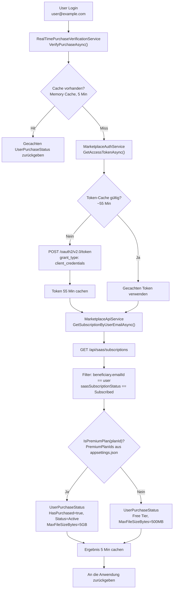
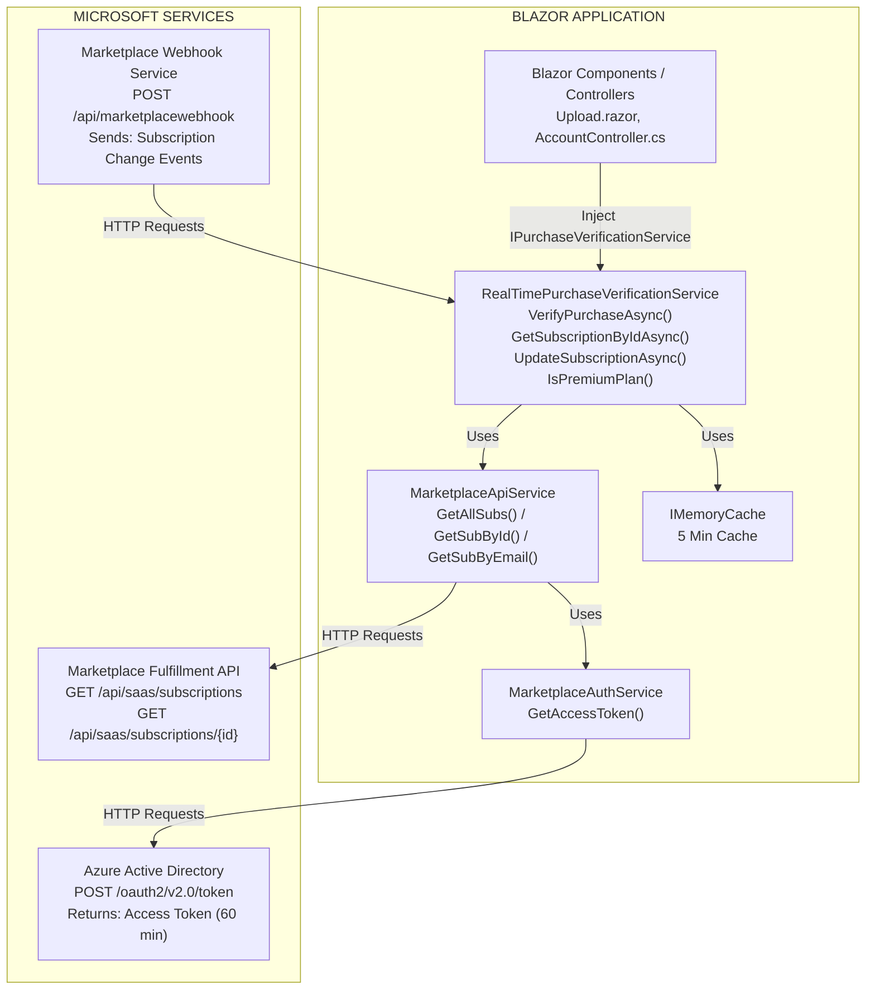
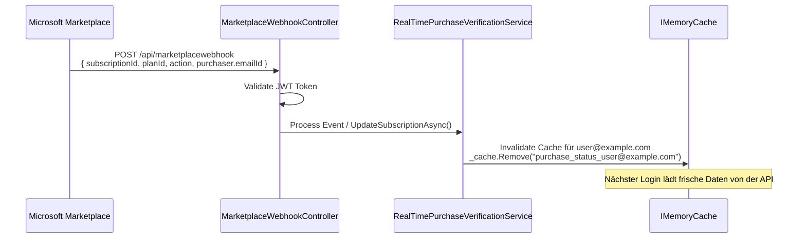
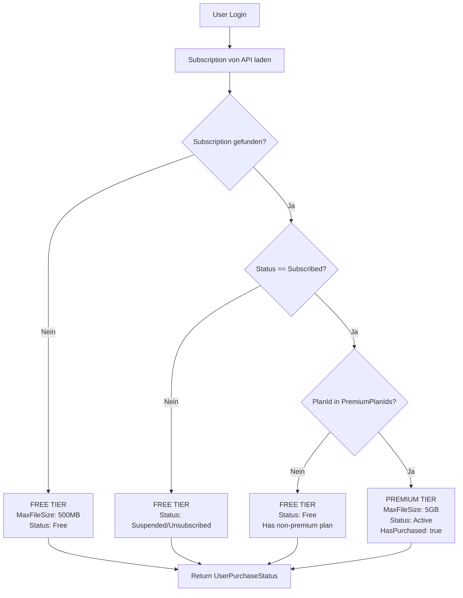
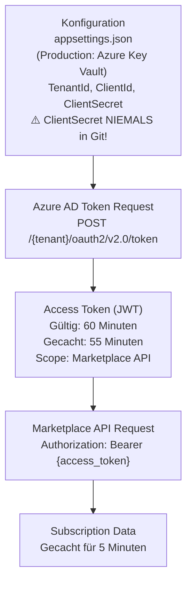

# 🏗️ Architektur-Übersicht: API-basierte Subscription-Verifizierung

> Die Diagramme sind in Mermaid verfasst und werden von GitHub direkt gerendert.

## 🔄 Login-Flow



Details:

- `PremiumPlanIds` (appsettings.json): `["premium", "pro", "enterprise"]`
- Beispiel-Antwort der API:

```json
{
  "subscriptions": [
    {
      "id": "sub-123",
      "planId": "premium",
      "saasSubscriptionStatus": "Subscribed",
      "beneficiary": { "emailId": "user@example.com" }
    }
  ]
}
```

## 🧩 Komponenten-Diagramm



## 🪝 Webhook-Integration



## ⚡ Caching-Strategie

- Cache-Key: `purchase_status_{userEmail}`
- Dauer: 5 Minuten (konfigurierbar über `CacheDurationMinutes`)
- Invalidierung:
  - Automatisch nach Ablauf (5 Minuten)
  - Manuell durch Webhook-Events
  - Manuell durch `UpdateSubscriptionAsync()`

Beispiel-Timeline:

| Zeit | Ereignis | Cache | API-Call |
|------|----------|-------|----------|
| 10:00 | Erster Login | Miss | GET /api/saas/subscriptions → Premium, Cache bis 10:05 |
| 10:02 | Zweiter Login (innerhalb 5 Min) | Hit | Kein API-Call (Performance!) |
| 10:03 | Webhook: Downgrade auf Free | Invalidiert | – |
| 10:04 | Dritter Login (nach Webhook) | Miss | GET /api/saas/subscriptions → Free, Cache bis 10:09 |
| 10:06 | Vierter Login (Cache von 10:00 abgelaufen) | Miss | GET /api/saas/subscriptions → aktueller Status, Cache bis 10:11 |

## 🌳 Decision Tree: Premium vs. Free



## 📈 Performance-Metriken

| Szenario | Antwortzeit |
|----------|-------------|
| Cache Hit (< 5 Min) | ~1 ms |
| Cache Miss + API-Call | ~50–200 ms |
| Token Refresh (stündlich) | ~100 ms (async, 55 Min gecacht) |

API-Calls pro Stunde (100 User):

| Variante | Rechnung | API-Calls |
|----------|----------|-----------|
| Ohne Cache | 100 User × 60 Logins/Stunde | 6.000 |
| Mit 5-Min-Cache | 100 User × 12 Logins/Stunde | 1.200 |

Reduktion: **80 % weniger API-Calls** 🎉

## 🔒 Security-Flow



---

**Dokumentation erstellt:** 2025-01-15  
**Version:** 2.0 (API-basiert)
